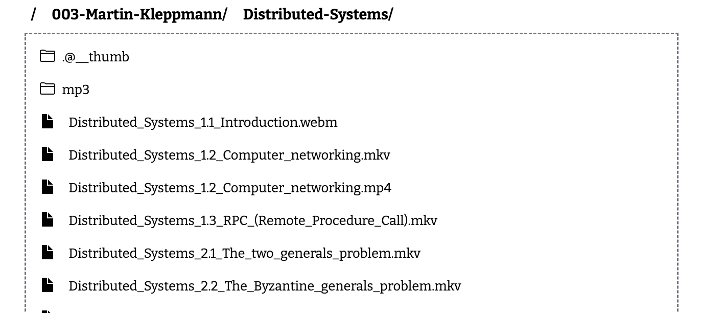

#+title: Web Video Player

This project is inspired by [[https://github.com/solidSpoon/DashPlayer][DashPlayer]]. The main target is to help people improve their English skills by watching videos.

You can deploy it on NAS using Docker. Since this is a web project, you can access it on smartphones, tablets, and computers.

* Features

Just one for now:
1. Lookup word quickly : When the cursor hover enter a word in the subtitle, the video will pause and a Chinese explanation will be displayed. After the cursor hover leave the word, the video will play and the explanation will hide.

* Screenshot

#+DOWNLOADED: screenshot @ 2024-12-22 17:27:25

* How to Run

** Clone the Code

#+begin_src shell
git clone https://github.com/ginqi7/web-video-player
#+end_src

** build server binary

#+begin_src shello
cd web-video-player
#+end_src

#+begin_src shello
go build
#+end_src

** Set Videos base path
#+begin_src shello
export WEB_VIDEO_PLAYER_BASE_PATH=/VIDEO_DATA_PATH/
#+end_src

** Run the server

#+begin_src shello
./web-video-player
#+end_src

It will start a server, you could aceess it by 127.0.0.1:8090 .

* Docker
** build
#+begin_src shello
docker build -t web-video-player:latest .
#+end_src

** docker compose
#+begin_src yaml
version: "3"
services:
server:
image: web-video-player:lastest
restart: unless-stopped
environment:
- WEB_VIDEO_PLAYER_BASE_PATH=/data
volumes:
- /some-your-path:/data
ports:
- "8082:8090"
#+end_src
